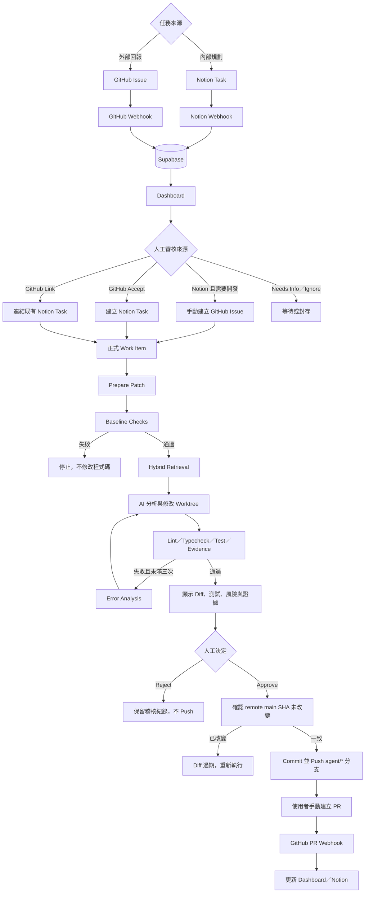

# Notion GitHub Coding Agent

一個以人工審核為核心的 AI 軟體工程工作平台。它將 Notion 的內部任務與 GitHub 的外部 Issue／PR 整合到同一套工作流，讓 AI Agent 在受限制的本機環境中分析程式碼、產生 Patch、執行檢查，最後由使用者決定是否推送分支。

> AI 可以準備修改，但不能自行決定上線。系統在人工核准前不會 push，PR 仍由使用者手動建立與合併。

## 專案解決什麼問題

- Notion 適合規劃內部工作，但不是每個任務都需要成為 GitHub Issue。
- 開源專案可能收到外部 GitHub Issue，不應未經審核就污染內部任務資料庫。
- AI 產生的程式碼不能只看文字回答，必須有 Diff、測試、風險與執行紀錄可供審核。
- 模型、Prompt 與檢索策略是否有效，應透過可重現的 Evaluation 驗證，而不是只看單次 Demo。

## 系統角色

| 元件 | 責任 |
| --- | --- |
| Notion | 建立與規劃內部 Task、Sprint、Deadline |
| GitHub | 接收外部 Issue，管理程式碼、分支與 PR |
| Next.js Dashboard | 審核 Issue、操作 Agent、查看 Diff／測試／Evaluation |
| Supabase Postgres | 保存跨平台關聯、同步工作、Agent Run 與稽核紀錄 |
| Python Worker | 建立隔離 worktree、檢索程式碼、產生 Patch、執行檢查與推送已核准分支 |
| OpenAI API | 正式 Task 的結構化分析、修改與 Embedding |
| Ollama | 僅供 Evaluation 比較本地模型，不可產生正式 Task Patch |

## 已完成功能

### Notion × GitHub 同步

- 驗證 GitHub 與 Notion Webhook，並以事件 ID 去重。
- Notion Task 同步至 Dashboard，但不會自動建立 GitHub Issue。
- 使用者可在 Task 詳情頁手動建立 GitHub Issue。
- 外部 GitHub Issue 先進入收件匣，可選擇接受、連結既有 Notion Task、等待更多資訊或忽略。
- GitHub PR 合併後更新 Dashboard 與 Notion 任務狀態。
- Reconciliation 定期補回漏送的 GitHub Issue／PR 狀態。
- 同步失敗會保存為工作，可檢視並重試。

### 任務與 Sprint

- 顯示任務來源、規劃狀態、Deadline、Sprint、Issue、PR 與 Agent 狀態。
- 支援 Current／Next／Last Sprint 與日期區間篩選。
- Notion Task 進入可執行狀態時可補上本週 Sprint 與週末 Deadline。
- Notion 頁面被刪除後，Dashboard 會標記來源已刪除，避免留下無法辨識的空白任務。

### AI Agent Patch 工作流

- 修改前先執行 install、lint、typecheck、test 等固定 Baseline 指令。
- 依關鍵字與 Embedding 執行 Hybrid Retrieval，選出相關程式碼 Context。
- 模型以結構化輸出產生分析、風險、修改計畫與完整檔案內容。
- Patch → Check → Error Analysis → Retry，最多三次。
- 保存 unified diff、測試紀錄、Token、成本、執行步驟與錯誤原因。
- Evidence Gate 驗證模型引用的檔案、行號與原始內容，模型不能自行宣告證據有效。
- 人工核准前不建立遠端分支；核准時重新確認 remote default branch SHA。
- 若 main 已更新，舊 Diff 失效，必須重新執行。
- 支援 Reject、取消、失敗清理及 Slack 通知。

### Evaluation 與可重現實驗

- 人工標記真實 Run 的分析正確性、Patch 可用性與失敗原因。
- 12 筆版本化 Agent Benchmark，涵蓋 Patch、安全拒絕與資訊不足案例。
- 以 hidden acceptance checks 驗證結果，不只判斷模型文字回答。
- 比較模型與 Prompt 的成功率、安全拒絕率、Token、成本與延遲。
- Benchmark regression gate 防止新版本低於既有基準。
- Retrieval Evaluation 比較 Keyword 與 Hybrid 的 Recall@K、Precision@K、MRR、Context 大小及延遲。
- Exact Replay 固定 Task snapshot、commit SHA、Context 路徑與檔案 hash，讓 Prompt 實驗可重現。
- Latest Main Rerun 可在最新主分支重跑，但不宣稱是嚴格控制實驗。
- 支援 `ollama:qwen2.5-coder:*` 本地模型 Benchmark，且限制為 Evaluation-only。

### 面試展示模式

`/demo` 會讀取 Supabase 中真實的 Original Run 與 Replay lineage，集中展示：

1. Intake 與人工控制
2. Hybrid Retrieval
3. Patch 修正循環
4. Evidence Gate
5. Exact Replay
6. Agent／Retrieval Evaluation

頁面不會為展示硬編造成功結果。若尚無 Replay 資料，會顯示設定提示。

## 完整 Workflow



## 技術架構

```text
Browser ───────→ Local Next.js Dashboard/API ───────→ Supabase Cloud
GitHub ─Webhook→ Next.js API                         ↑
Notion ─Webhook→ Next.js API                         │
Python Worker ───────────────────────────────────────┘
      │
      ├─→ OpenAI Responses／Embeddings API
      ├─→ Local Git Worktree
      └─→ GitHub agent/* branch（僅人工核准後）
```

主要技術：Next.js 15、React 19、TypeScript、Supabase Postgres、Python 3.12、OpenAI Responses API、pgvector、Vitest、Pytest、Vercel。

## 專案結構

```text
notion-github-coding-agent/
├─ apps/web/                  Next.js Dashboard 與 API routes
├─ workers/agent/             Python Agent Worker 與 Evaluation runner
├─ packages/shared/           共用型別
├─ supabase/migrations/       資料庫 migrations
├─ supabase/seed.sql          單一專案／repository 初始設定
├─ docs/                      架構、流程、安全、Evaluation 與 Demo 文件
├─ .env.example              環境變數範本
└─ vercel.json               Vercel Cron 設定
```

## 啟動前需求

- Node.js 20+
- pnpm 11.16.0
- Python 3.12+
- Git
- 一個 Supabase Cloud project
- GitHub fine-grained PAT 與 repository webhook
- Notion internal integration、Data Source 與 webhook
- OpenAI API key
- 選用：Slack Incoming Webhook、Ollama、Vercel CLI

第一版只支援單一管理者、單一 Notion workspace 與單一 GitHub repository。

## 安裝與設定

### 1. 安裝 Web 依賴

```bash
cd /Users/leochang/Desktop/notion-github-coding-agent
pnpm install
```

### 2. 設定環境變數

```bash
cp .env.example .env.local
```

填入以下欄位：

| 變數 | 用途 |
| --- | --- |
| `NEXT_PUBLIC_SUPABASE_URL` | Supabase Project URL |
| `NEXT_PUBLIC_SUPABASE_ANON_KEY` | 瀏覽器端 Supabase anon key |
| `SUPABASE_SERVICE_ROLE_KEY` | Server／Worker 使用的 service role key |
| `GITHUB_TOKEN` | 存取指定 repository、建立 Issue 與 push branch |
| `GITHUB_WEBHOOK_SECRET` | 驗證 GitHub webhook 簽章 |
| `NOTION_TOKEN` | Notion internal integration token |
| `NOTION_WEBHOOK_SECRET` | 驗證 Notion webhook |
| `NOTION_DATA_SOURCE_ID` | Task database 對應的 Data Source ID |
| `OPENAI_API_KEY` | 正式 Agent 與 Embedding |
| `OPENAI_MODEL` | 正式 Agent 模型 |
| `OPENAI_EMBEDDING_MODEL` | Repository index 的 Embedding 模型 |
| `INTERNAL_JOB_SECRET` | 保護內部同步 API |
| `CRON_SECRET` | 保護 Vercel reconciliation cron |
| `DASHBOARD_PASSWORD` | Dashboard 登入密碼 |
| `DASHBOARD_SESSION_SECRET` | Dashboard session cookie secret |
| `SLACK_WEBHOOK_URL` | 選用；Agent 結果通知 |
| `DASHBOARD_URL` | 通知內使用的 Dashboard 網址 |

不要提交 `.env.local`，也不要把 service role key、PAT 或 webhook secret 放進前端程式碼。

### 3. 建立 Supabase Schema

將 `supabase/migrations/` 內 SQL 依檔名順序套用，再依自己的 repository 修改並套用 `supabase/seed.sql`。

```text
202608120001_initial_schema.sql
202608130001_add_work_item_deadline.sql
...
202608130009_add_agent_replay.sql
```

Seed 中至少要正確設定：

- GitHub owner／repository
- default branch
- 本機 repository 絕對路徑
- install、lint、typecheck、test 指令
- Notion Data Source ID

### 4. 建立 Python Worker 環境

```bash
cd /Users/leochang/Desktop/notion-github-coding-agent/workers/agent
python3.12 -m venv .venv
source .venv/bin/activate
pip install -e '.[dev]'
```

Worker 會向上尋找專案根目錄的 `.env.local`。

## 啟動方式

需要同時開兩個 Terminal。

### Terminal 1：Next.js Dashboard

```bash
cd /Users/leochang/Desktop/notion-github-coding-agent
pnpm dev
```

開啟 [http://localhost:3000](http://localhost:3000)。

### Terminal 2：Python Worker

```bash
cd /Users/leochang/Desktop/notion-github-coding-agent/workers/agent
source .venv/bin/activate
python -m agent_worker.worker
```

只處理目前一筆工作後結束：

```bash
python -m agent_worker.worker --once
```

停止服務請在各自 Terminal 按 `Ctrl+C`。

## Webhook 與部署

本機開發需透過 Cloudflare Tunnel 或 ngrok 暴露 `localhost:3000`，或直接使用 Vercel 部署網址。

```text
GitHub Payload URL
https://<your-domain>/api/webhooks/github

Notion Webhook URL
https://<your-domain>/api/webhooks/notion
```

GitHub webhook 至少訂閱 Issues、Pull requests 與 Ping。GitHub 與 Notion 設定的 secret 必須和 `.env.local`／Vercel Environment Variables 完全一致。

本機 Demo 如需立即消化待重試的 Notion 同步工作，可呼叫：

```bash
curl -X POST http://localhost:3000/api/internal/sync-jobs/process \
  -H "Authorization: Bearer $INTERNAL_JOB_SECRET"
```

Vercel Cron 會定期執行 reconciliation，作為 webhook 漏送時的安全網，不取代 webhook。

## 使用方法

### 流程 A：從 Notion 開始

1. 在 Notion Task database 建立任務。
2. 等待 webhook 後，在 Dashboard「任務」確認資料。
3. 將需要寫程式的任務改為可執行，確認 Sprint 與 Deadline。
4. 在 Task 詳情按「建立 GitHub Issue」。
5. 按「Prepare Patch」，由 Python Worker 執行分析與測試。
6. 查看 AI 摘要、Evidence、Diff、Baseline 與修改後檢查結果。
7. 選擇 Reject，或 Approve 後推送 `agent/*` 分支。
8. 在 GitHub 手動建立 PR；合併後狀態會回寫 Dashboard 與 Notion。

### 流程 B：從外部 GitHub Issue 開始

1. 外部使用者在 GitHub 建立 Issue。
2. Issue 透過 webhook 進入「GitHub 收件匣」。
3. 選擇：
   - **接受**：建立新的 Notion Task。
   - **連結**：搜尋並連結既有 Notion Task。
   - **需要更多資訊**：暫不進入正式工作清單。
   - **忽略**：封存且後續更新不會讓它重新出現在收件匣。
4. 接受或連結後，依流程 A 執行 Agent Patch 與人工核准。

### 執行 Evaluation

Dashboard 的「Evaluation」頁可排程完整 Dataset 或單一案例，並比較 Prompt／模型結果。排程後必須保持 Python Worker 運行。

CLI 執行 Agent Benchmark：

```bash
cd /Users/leochang/Desktop/notion-github-coding-agent/workers/agent
source .venv/bin/activate
agent-eval
```

CLI 執行 Retrieval Evaluation：

```bash
python -m agent_worker.retrieval_eval
```

若使用 Ollama，模型名稱以 `ollama:` 開頭，例如 `ollama:qwen2.5-coder:1.5b`。本地模型只允許執行 Evaluation，不會取得正式 Task 的推送能力。

## 驗證專案

### Web

```bash
cd /Users/leochang/Desktop/notion-github-coding-agent
pnpm lint
pnpm typecheck
pnpm test
pnpm build
```

### Worker

```bash
cd /Users/leochang/Desktop/notion-github-coding-agent/workers/agent
source .venv/bin/activate
ruff check .
pytest
```

## Agent 安全邊界

- 僅操作資料庫白名單中的本機 repository。
- 每次 Run 使用獨立 Git worktree。
- Baseline 原本失敗時不允許 AI 修改。
- 最多修改 3 個既有程式碼／測試檔案，最多重試 3 次。
- 禁止 `.env`、credentials、SSH keys、migration、CI/CD、部署、權限、付款、lockfile 與路徑逃逸。
- 模型不能自由執行 shell；只能使用 repository 預先設定的檢查指令。
- 禁止 force-push、直接修改 default branch、自動建立 PR 或自動 merge。
- Approve 前重新檢查 base SHA，避免把過期 Patch 推到新的 main。
- Prompt injection 只能被視為 Issue 內容，不能覆寫 Worker policy。

## 已知限制

- 第一版是單一管理者、單一 repository 的本機 Demo，不是多人 SaaS。
- Python Worker 必須在可存取目標 repository 的本機持續運行。
- PR 建立與合併仍由人工完成。
- 不做 Notion 與 GitHub title／description 的持續雙向覆寫。
- Evaluation Dataset 只有 12 個案例，適合回歸測試與面試展示，不代表 production 統計結論。
- 現有 Retrieval Evaluation 中 Keyword 與 Hybrid 品質相同，而 Hybrid 延遲較高；目前沒有證據宣稱 Embedding 一定更好。
- 小型本地模型的 smoke test 未通過，因此被限制在 Evaluation-only。

## 面試 Demo

啟動 Dashboard 與 Worker 後開啟：

- Demo Mode：[http://localhost:3000/demo](http://localhost:3000/demo)
- 五分鐘講解腳本：[docs/demo-script.md](docs/demo-script.md)
- E2E Replay 紀錄：[docs/e2e-agent-replay.md](docs/e2e-agent-replay.md)

DEMO 影片將另外補上。

## 延伸文件

- [系統架構](docs/architecture.md)
- [完整工作流程](docs/workflow.md)
- [資料庫設計](docs/database.md)
- [Agent 安全設計](docs/agent-safety.md)
- [Evaluation 設計](docs/evaluation.md)
- [五分鐘 Demo 腳本](docs/demo-script.md)

## 為什麼不是單純重造同步工具

本專案的核心不是複製 Notion 或 GitHub，而是處理兩者中間缺少的「工程決策層」：外部 Issue 必須先被人審核、內部 Task 不一定要污染 GitHub、AI 修改必須經過可驗證的檢查與證據、模型改版必須能透過 Benchmark 與 Replay 比較。同步只是入口，真正的產品價值是可控、可追蹤、可重現的 AI coding workflow。
