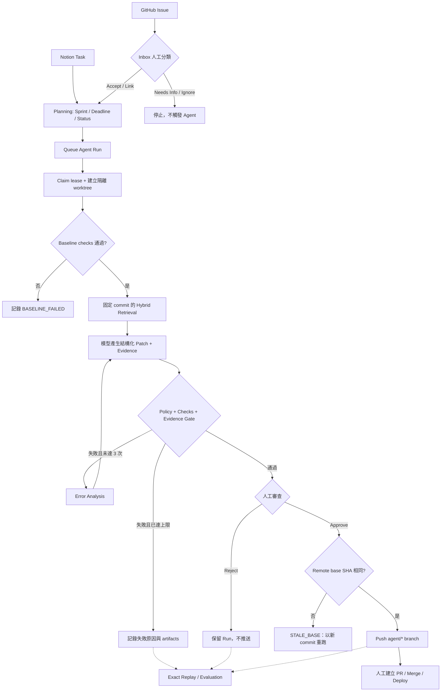

# Notion GitHub Coding Agent

一個 **human-in-the-loop AI coding workflow**：把 Notion 的內部任務與 GitHub 的外部 Issue 收進同一個工作台，讓 AI 在隔離的本機 worktree 分析程式碼、產生 patch 並執行檢查，最後由人決定是否推送分支。

> AI 可以準備修改，但不能自行上線。系統在人工核准前不會 push，也不會自動建立或合併 PR。

## 專案介紹影片

想先快速了解完整操作流程，可以觀看 [notion-github-coding-agent DEMO](https://youtu.be/TPr4YH-15n8)：

[](https://youtu.be/TPr4YH-15n8)

## 線上展示

- 網址：[https://notion-github-coding-agent.vercel.app](https://notion-github-coding-agent.vercel.app)
- 公開 Demo，免登入即可瀏覽

## 這個專案解決什麼問題

Notion 適合安排內部工作，GitHub 適合追蹤程式問題，但兩者都無法單獨回答以下問題：

1. 外部 Issue 的資訊是否足夠，能不能進入內部開發流程？
2. AI 修改前，如何證明原始專案本來可以正常建置與測試？
3. 模型看到哪些程式碼、改了哪些檔案、提出的證據是否真實？
4. 當 main branch 已經改變，如何避免推送建立在舊版本上的 Patch？
5. 換模型或 Prompt 後，如何在相同輸入條件下比較結果？

因此本專案在 Notion、GitHub 與 AI Agent 之間加入一層「工程決策與驗證流程」。AI 可以準備修改，但輸入範圍、修改權限、驗證條件與最終推送都由系統和人共同控制。

## 一筆任務如何走完整個工作流

### 1. Intake：先決定這是不是一筆可執行工作

- **Notion Task** 是內部規劃來源，保存描述、驗收條件、Sprint、Deadline 與規劃狀態。
- **GitHub Issue** 是外部輸入，先進入 Inbox，不會直接觸發 Agent。
- 使用者可以對 Issue 執行 Accept、連結既有 Notion Task、Needs Info 或 Ignore，避免資訊不足與重複任務進入工程流程。
- Webhook 事件以 provider event ID 去重；排程 reconciliation 補回漏送事件，兩者共同維持最終一致性。

### 2. Planning：把「需求狀態」與「AI 執行狀態」分開

Task 的草稿、可執行、進行中、受阻與完成，描述的是工程規劃；Agent 的 queued、preparing、awaiting approval、failed 等狀態，描述的是自動化執行。兩套狀態不互相假設，避免「任務進行中」被誤解成「AI 正在修改」。

Sprint 依日期自動計算 `Past → Last → Current → Next → Future`，但未完成任務不會被自動搬移。使用者先在延續檢視中確認，再更新 Sprint 與 Deadline；Notion 與 Supabase 若出現落差，也能逐筆重新同步。

### 3. Baseline：先證明問題不是環境原本就壞了

按下 Prepare Patch 後，Worker 會鎖定 task snapshot、repository 與 base commit，建立隔離的 Git worktree，再依 repository 設定執行 install、lint、typecheck 與 test。

Baseline 失敗時流程立即停止，模型不會收到修改權限。這讓「AI 改壞專案」與「專案原本就無法通過檢查」可以被清楚區分。

### 4. Retrieval 與 Patch：限制模型看到與能修改的範圍

系統不會把整個 repository 直接送給模型，而是以固定 commit 建立檔案索引，結合 keyword 與 embedding rank 選出相關 Context。Embedding 無法使用時會降級為 keyword retrieval，並保留檢索方法、耗時、檔案路徑與 hash。

模型回傳結構化分析與完整檔案替換；Policy 最多允許修改 3 個既有檔案，禁止碰觸 secrets、migration、CI/CD、部署與權限等敏感範圍。每次修改後重新執行 checks，失敗時將錯誤摘要交回模型，最多重試 3 次。

### 5. Evidence Gate：驗證模型的理由，不只驗證測試結果

每項修改必須引用檔案、行號、原始內容與修改理由。Worker 只針對「實際送入模型的 exact Context」驗證引用：路徑必須存在、行號必須正確、原文必須一致。

因此模型即使產生看似合理的說明，只要引用不存在的程式碼，Run 仍會被 Gate 阻擋。通過後保存的是實際 Git Diff、checks、risk、evidence 與 token／cost，而不是單純的「模型說完成了」。

### 6. Human Gate：核准後仍要防止 stale patch

Run 通過 checks 與 Evidence Gate 後進入 `awaiting_approval`。使用者先審查 Diff、測試、風險與證據，再選擇 Reject 或 Approve。

- Reject：不推送任何遠端分支，但保留完整稽核紀錄。
- Approve：重新 fetch remote default branch，確認 SHA 仍等於 Run 的 base commit。
- SHA 已改變：標記為 stale，不允許推送，必須用新 base 重新執行。
- SHA 未改變：只推送 `agent/*` 獨立分支；PR 建立、合併與部署仍由人完成。

### 7. Replay 與 Evaluation：讓模型比較不依賴單次 Demo

Original Run 保存第一次執行的 task snapshot、commit、Context 路徑與 hash。Exact Replay 固定這些輸入條件，再執行不同模型或 Prompt，避免比較結果被不同程式碼版本或不同檢索內容污染。

Agent Benchmark 另外使用受控 fixture 與 hidden acceptance checks，涵蓋 Patch、Safe Refusal、Regression 與品質案例；Retrieval Evaluation 則比較 keyword 與 hybrid 的 Recall、Precision、MRR、Context size 與 latency。

## 完整狀態流程



## 技術難點與設計取捨

| 難點                       | 直接做法的風險                                   | 本專案的處理方式                                                                 |
| -------------------------- | ------------------------------------------------ | -------------------------------------------------------------------------------- |
| Notion／GitHub 雙來源同步  | 重複事件、漏送事件、兩邊狀態互相覆寫             | Webhook event ID 去重、sync job retry、reconciliation 補償、欄位責任分離         |
| 多 Worker 與中斷恢復       | 同一 Run 被重複處理，或 crash 後永遠卡在 running | Active Run 唯一限制、claim owner、lease expiry 與 stale run recovery             |
| LLM Context 選擇           | 整個 repo 太大；不同 Run 看到不同內容而難以比較  | commit-bound index、Hybrid Retrieval、Context path/hash 持久化、keyword fallback |
| Patch 安全性               | 模型修改敏感檔案、執行任意指令或擴大變更範圍     | worktree 隔離、指令白名單、敏感路徑 policy、最多 3 個檔案                        |
| 「測試通過」仍可能理由錯誤 | 模型引用不存在的程式碼，審查者難以發現           | Evidence Gate 對 exact Context 驗證 path、line、quote                            |
| 核准與推送之間的競態       | main 已更新，舊 Patch 仍被推送                   | Approve 時重新 fetch 並比較 base SHA；不一致即拒絕推送                           |
| 模型／Prompt 評估          | 單次 Demo 的成功無法公平比較                     | Exact Replay 固定輸入；Benchmark 使用 hidden checks 與 refusal cases             |

## Demo 導覽

先觀看 [專案介紹影片](https://youtu.be/TPr4YH-15n8)，或啟動 Web 後開啟 [http://localhost:3000/demo](http://localhost:3000/demo)。Demo 頁依序展示：

1. 雙來源 Intake 與人工決策
2. Baseline 與 commit-bound Context Retrieval
3. Patch、Checks、Error Analysis 與 Retry
4. Evidence Gate 與人工核准
5. Original Run 與 Exact Replay
6. Agent Benchmark 與 Retrieval Evaluation

錄影流程可沿用 [Demo 腳本](docs/demo-script.md)，真實案例與限制見 [E2E Replay 紀錄](docs/e2e-agent-replay.md)。

## 技術架構

```text
Browser ───────→ Next.js Dashboard / API ───────→ Supabase Postgres
GitHub ─Webhook→ Next.js API                         ↑
Notion ─Webhook→ Next.js API                         │
Python Worker ───────────────────────────────────────┘
      │
      ├─ OpenAI Responses / Embeddings API
      ├─ isolated local Git worktree
      └─ GitHub agent/* branch（僅人工核准後）
```

| 元件                         | 責任                                                               |
| ---------------------------- | ------------------------------------------------------------------ |
| Next.js 15 / React 19        | Dashboard、Webhook 與操作 API                                      |
| Supabase Postgres / pgvector | 跨平台關聯、同步工作、Run、稽核與 repository embeddings            |
| Python 3.12 Worker           | Retrieval、worktree、patch、檢查、replay、evaluation 與核准後 push |
| OpenAI API                   | 正式 Task 的結構化分析、修改與 embeddings                          |
| Ollama（選用）               | 僅供 Evaluation 比較本地模型，不可產生正式 Task patch              |

## 專案結構

```text
notion-github-coding-agent/
├─ apps/web/                 Next.js Dashboard、API routes 與 Vercel Cron 設定
├─ workers/agent/            Python Worker、benchmark 與 retrieval evaluation
├─ supabase/migrations/      Database migrations（schema source of truth）
├─ supabase/seed.sql         單一 repository 的初始設定
├─ docs/                     架構、流程、安全、evaluation 與 Demo 文件
├─ .env.example              環境變數範本
└─ pnpm-workspace.yaml       pnpm workspace 設定
```

## 本機啟動

### 需求

- Node.js 20+
- pnpm 11.16.0
- Python 3.12+
- Git
- Supabase Cloud project
- GitHub fine-grained PAT 與 repository webhook
- Notion internal integration、Data Source 與 webhook
- Sprint Data Source 需包含 Start Date、End Date、Status、Window 與 Week Key；每日排程會自動輪替 Future／Next／Current／Last／Past
- OpenAI API key
- 選用：Slack Incoming Webhook、Ollama、Vercel CLI

目前版本以單一管理者、單一 Notion workspace、單一 GitHub repository 為目標。

### 1. 安裝 Web

```bash
git clone <repository-url>
cd notion-github-coding-agent
corepack enable
pnpm install
```

### 2. 設定環境變數

```bash
cp .env.example apps/web/.env.local
```

必要設定：

| 變數                            | 用途                                            |
| ------------------------------- | ----------------------------------------------- |
| `NEXT_PUBLIC_SUPABASE_URL`      | Supabase Project URL                            |
| `NEXT_PUBLIC_SUPABASE_ANON_KEY` | Supabase anon key                               |
| `SUPABASE_SERVICE_ROLE_KEY`     | Server 與 Worker 的資料庫存取                   |
| `GITHUB_TOKEN`                  | 讀取 repository、建立 Issue、核准後 push branch |
| `GITHUB_WEBHOOK_SECRET`         | 驗證 GitHub webhook 簽章                        |
| `NOTION_TOKEN`                  | Notion internal integration token               |
| `NOTION_WEBHOOK_SECRET`         | 驗證 Notion webhook                             |
| `NOTION_DATA_SOURCE_ID`         | Task database 的 Data Source ID                 |
| `OPENAI_API_KEY`                | 正式 Agent 與 embeddings                        |
| `INTERNAL_JOB_SECRET`           | 保護內部同步 API                                |
| `CRON_SECRET`                   | 保護 reconciliation cron                        |

模型、Worker polling、timeout、Slack 等選用設定與預設值都列在 [.env.example](.env.example)。不要提交 `.env.local`，也不要把 service role key、PAT 或 webhook secret 放進前端程式碼。

### 3. 建立資料庫

依檔名順序套用 `supabase/migrations/` 中的 SQL，再依目標 repository 修改並執行 `supabase/seed.sql`。Seed 至少要設定：

- GitHub owner、repository 與 default branch
- 本機 repository 絕對路徑
- install、lint、typecheck、test 指令
- Notion Data Source ID

詳細資料模型見 [Database](docs/database.md)。

### 4. 安裝 Worker

```bash
cd workers/agent
python3.12 -m venv .venv
source .venv/bin/activate
pip install -e '.[dev]'
cd ../..
```

Web 與 Worker 都會讀取 `apps/web/.env.local`；Worker 也會在其後讀取專案根目錄的 `.env`，但不覆寫已設定的值。

### 5. 同時啟動 Web 與 Worker

Terminal 1：

```bash
pnpm dev
```

Terminal 2：

```bash
cd workers/agent
source .venv/bin/activate
python -m agent_worker.worker
```

開啟 [http://localhost:3000](http://localhost:3000)。若只想讓 Worker 處理目前一筆工作後結束，加入 `--once`。

## 事件通知與部署設定

本機開發可用 tunnel 暴露 `localhost:3000`，或使用 Vercel 部署網址：

```text
GitHub: https://<your-domain>/api/webhooks/github
Notion: https://<your-domain>/api/webhooks/notion
```

GitHub webhook 至少訂閱 **Issues、Pull requests、Ping**；兩邊設定的 secret 必須與環境變數一致。`apps/web/vercel.json` 每天 16:05 UTC（台北時間 00:05）執行 Sprint 輪替與 reconciliation，補回漏送事件，但不取代 webhook。

本機若要立即處理待重試的 Notion 同步工作：

```bash
curl -X POST http://localhost:3000/api/internal/sync-jobs/process \
  -H "Authorization: Bearer $INTERNAL_JOB_SECRET"
```

## 主要操作流程

### 從 Notion 開始

1. 在 Notion Task database 建立任務，等待 webhook 匯入 Dashboard。
2. 確認 Sprint、Deadline 與可執行狀態，再手動建立 GitHub Issue。
3. 按 **Prepare Patch**，由 Worker 執行 baseline、retrieval、修改與檢查。
4. 審核摘要、evidence、diff、風險與測試結果。
5. Reject，或 Approve 後推送 `agent/*` 分支。
6. 在 GitHub 手動建立 PR；合併後狀態回寫 Dashboard 與 Notion。

### 從 GitHub Issue 開始

1. 新 Issue 經 webhook 進入 **GitHub 收件匣**。
2. 選擇 Accept、Link existing Notion Task、Needs Info 或 Ignore。
3. Accept／Link 後再進入相同的 Prepare Patch 與人工核准流程。

## 評估

Web 的 **模型評估**頁可排程完整 dataset 或單一案例，並比較 prompt／模型結果；執行期間必須保持 Worker 運行。

```bash
cd workers/agent
source .venv/bin/activate

# 驗證 Benchmark Dataset，不呼叫模型
python -m agent_worker.eval_runner --validate-only

# 執行包含 12 個案例的 Agent Benchmark
agent-eval

# 比較 Keyword 與 Hybrid Retrieval
retrieval-eval
```

Benchmark 包含 5 個 patch、5 個 safety、2 個 quality 案例，使用 hidden acceptance checks 驗證修改。Dataset 規模只適合回歸與展示，不代表 production 統計結論。若使用 Ollama，模型名稱以 `ollama:` 開頭；本地模型只允許 Evaluation，沒有正式 Task 的推送能力。完整方法與限制見 [Evaluation 設計](docs/evaluation.md)。

## 驗證

Web：

```bash
pnpm lint
pnpm typecheck
pnpm test
pnpm build
```

Worker：

```bash
cd workers/agent
source .venv/bin/activate
ruff check .
pytest
```

## 安全邊界

- 僅操作資料庫白名單中的本機 repository；每次 Run 使用獨立 worktree。
- Baseline 失敗時不允許 AI 修改；模型不能自由執行 shell。
- 禁止修改 secrets、migration、CI/CD、部署、權限、付款與 lockfile 等敏感範圍。
- 禁止 force-push、直接修改 default branch、自動建立 PR 或自動 merge。
- Approve 前重新檢查 base SHA；main 更新後舊 diff 必須重跑。
- 外部 Issue 與 Notion 內容一律視為不受信任資料，不能覆寫 Worker policy。

更完整的 threat model 與 enforcement 見 [Agent 安全設計](docs/agent-safety.md)。

## 已知限制

- 目前是單一管理者、單一 repository 的本機導向 Demo，不是多人 SaaS。
- Worker 必須在可存取目標 repository 的機器上持續運行。
- PR 建立與合併仍由人工完成。
- 不持續雙向覆寫 Notion 與 GitHub 的 title／description。
- 現有 Retrieval Evaluation 中 Keyword 與 Hybrid 品質相同，而 Hybrid 延遲較高；目前沒有證據宣稱 embeddings 一定更好。
- 已測試的小型本地模型 smoke test 未通過，因此限制為 Evaluation-only。

## 文件

- [系統架構](docs/architecture.md)
- [完整工作流程](docs/workflow.md)
- [資料庫設計](docs/database.md)
- [Agent 安全設計](docs/agent-safety.md)
- [Evaluation 設計](docs/evaluation.md)
- [Demo 錄影腳本](docs/demo-script.md)
- [E2E Replay 紀錄](docs/e2e-agent-replay.md)
