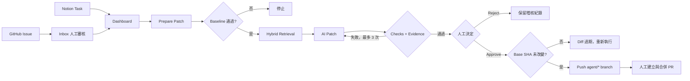

# Notion GitHub Coding Agent

一個 **human-in-the-loop AI coding workflow**：把 Notion 的內部任務與 GitHub 的外部 Issue 收進同一個工作台，讓 AI 在隔離的本機 worktree 分析程式碼、產生 patch 並執行檢查，最後由人決定是否推送分支。

> AI 可以準備修改，但不能自行上線。系統在人工核准前不會 push，也不會自動建立或合併 PR。

## 專案介紹影片

想先快速了解完整操作流程，可以觀看 [notion-github-coding-agent DEMO](https://youtu.be/2L_xbkq8Ges)：

[](https://youtu.be/2L_xbkq8Ges)

## 線上展示

- 網址：[https://notion-github-coding-agent.vercel.app](https://notion-github-coding-agent.vercel.app)
- 公開 Demo，免登入即可瀏覽

## 為什麼做這個專案

Notion 適合規劃工作，GitHub 適合管理程式碼，但兩者之間仍缺少一個「工程決策層」：

- 不是每個 Notion Task 都需要成為 GitHub Issue。
- 外部 GitHub Issue 不應未經審核就進入內部工作清單。
- AI 產生的修改必須附帶 diff、測試、風險與可驗證的程式碼證據。
- 模型與 prompt 的改動應以可重現的 benchmark 和 replay 評估，而不是只看單次成功 Demo。

本專案的重點不是再做一套同步工具，而是讓 AI coding 的輸入、修改、審核與評估都可控、可追蹤、可重現。

## 核心能力

| 能力 | 做法 |
| --- | --- |
| 雙來源 Intake | Notion Task 匯入 Dashboard；外部 GitHub Issue 先進 Inbox，經人工 Accept、Link、Needs Info 或 Ignore |
| 受控 Patch | Baseline 通過後才允許模型修改；每次 Run 使用獨立 Git worktree，最多修改 3 個既有檔案、重試 3 次 |
| Evidence Gate | 模型必須引用檔案、行號與原文；Worker 會對實際送入模型的 Context 做確定性驗證 |
| 人工核准 | 核准前不建立遠端分支；核准時重新確認 remote default branch SHA，避免推送過期 diff |
| 可重現實驗 | Exact Replay 固定 Task snapshot、commit、Context 路徑與 hash；Benchmark 使用 hidden acceptance checks |
| 可觀測性 | 保存 diff、檢查結果、執行步驟、錯誤、token、成本與評估結果 |

## 五分鐘 Demo

如果只想快速了解專案，可以先觀看 [專案介紹影片](https://youtu.be/2L_xbkq8Ges)，或啟動 Web 後直接開啟 [http://localhost:3000/demo](http://localhost:3000/demo)。頁面會使用 Supabase 中真實的 Original Run 與 Replay lineage，依序展示：

1. Notion／GitHub intake 與人工控制
2. Hybrid Retrieval
3. Patch、Check、Error Analysis、Retry
4. Evidence Gate
5. Exact Replay
6. Agent 與 Retrieval Evaluation

Demo 不會硬編造成功資料；若資料庫尚無 Replay，頁面會顯示設定提示。錄影可直接沿用 [五分鐘 Demo 腳本](docs/demo-script.md)，驗證過的案例與數據見 [E2E Replay 紀錄](docs/e2e-agent-replay.md)。

## 工作流程



## 技術架構

```text
Browser ───────→ Next.js Dashboard / API ───────→ Supabase Postgres
GitHub ─Webhook→ Next.js API                         ↑
Notion ─Webhook→ Next.js API                         │
Python Worker ───────────────────────────────────────┘
      │
      ├─ OpenAI Responses / Embeddings API
      ├─ isolated local Git worktree
      └─ GitHub agent/* branch（僅人工核准後）
```

| 元件 | 責任 |
| --- | --- |
| Next.js 15 / React 19 | Dashboard、Webhook 與操作 API |
| Supabase Postgres / pgvector | 跨平台關聯、同步工作、Run、稽核與 repository embeddings |
| Python 3.12 Worker | Retrieval、worktree、patch、檢查、replay、evaluation 與核准後 push |
| OpenAI API | 正式 Task 的結構化分析、修改與 embeddings |
| Ollama（選用） | 僅供 Evaluation 比較本地模型，不可產生正式 Task patch |

## 專案結構

```text
notion-github-coding-agent/
├─ apps/web/                 Next.js Dashboard、API routes 與 Vercel Cron 設定
├─ workers/agent/            Python Worker、benchmark 與 retrieval evaluation
├─ supabase/migrations/      Database migrations（schema source of truth）
├─ supabase/seed.sql         單一 repository 的初始設定
├─ docs/                     架構、流程、安全、evaluation 與 Demo 文件
├─ .env.example              環境變數範本
└─ pnpm-workspace.yaml       pnpm workspace 設定
```

## 本機啟動

### 需求

- Node.js 20+
- pnpm 11.16.0
- Python 3.12+
- Git
- Supabase Cloud project
- GitHub fine-grained PAT 與 repository webhook
- Notion internal integration、Data Source 與 webhook
- Sprint Data Source 需包含 Start Date、End Date、Status、Window 與 Week Key；每日排程會自動輪替 Future／Next／Current／Last／Past
- OpenAI API key
- 選用：Slack Incoming Webhook、Ollama、Vercel CLI

目前版本以單一管理者、單一 Notion workspace、單一 GitHub repository 為目標。

### 1. 安裝 Web

```bash
git clone <repository-url>
cd notion-github-coding-agent
corepack enable
pnpm install
```

### 2. 設定環境變數

```bash
cp .env.example .env.local
```

必要設定：

| 變數 | 用途 |
| --- | --- |
| `NEXT_PUBLIC_SUPABASE_URL` | Supabase Project URL |
| `NEXT_PUBLIC_SUPABASE_ANON_KEY` | Supabase anon key |
| `SUPABASE_SERVICE_ROLE_KEY` | Server 與 Worker 的資料庫存取 |
| `GITHUB_TOKEN` | 讀取 repository、建立 Issue、核准後 push branch |
| `GITHUB_WEBHOOK_SECRET` | 驗證 GitHub webhook 簽章 |
| `NOTION_TOKEN` | Notion internal integration token |
| `NOTION_WEBHOOK_SECRET` | 驗證 Notion webhook |
| `NOTION_DATA_SOURCE_ID` | Task database 的 Data Source ID |
| `OPENAI_API_KEY` | 正式 Agent 與 embeddings |
| `INTERNAL_JOB_SECRET` | 保護內部同步 API |
| `CRON_SECRET` | 保護 reconciliation cron |

模型、Worker polling、timeout、Slack 等選用設定與預設值都列在 [.env.example](.env.example)。不要提交 `.env.local`，也不要把 service role key、PAT 或 webhook secret 放進前端程式碼。

### 3. 建立資料庫

依檔名順序套用 `supabase/migrations/` 中的 SQL，再依目標 repository 修改並執行 `supabase/seed.sql`。Seed 至少要設定：

- GitHub owner、repository 與 default branch
- 本機 repository 絕對路徑
- install、lint、typecheck、test 指令
- Notion Data Source ID

詳細資料模型見 [Database](docs/database.md)。

### 4. 安裝 Worker

```bash
cd workers/agent
python3.12 -m venv .venv
source .venv/bin/activate
pip install -e '.[dev]'
cd ../..
```

Worker 會向上尋找專案根目錄的 `.env.local`。

### 5. 同時啟動 Web 與 Worker

Terminal 1：

```bash
pnpm dev
```

Terminal 2：

```bash
cd workers/agent
source .venv/bin/activate
python -m agent_worker.worker
```

開啟 [http://localhost:3000](http://localhost:3000)。若只想讓 Worker 處理目前一筆工作後結束，加入 `--once`。

## 事件通知與部署設定

本機開發可用 tunnel 暴露 `localhost:3000`，或使用 Vercel 部署網址：

```text
GitHub: https://<your-domain>/api/webhooks/github
Notion: https://<your-domain>/api/webhooks/notion
```

GitHub webhook 至少訂閱 **Issues、Pull requests、Ping**；兩邊設定的 secret 必須與環境變數一致。`apps/web/vercel.json` 每天 04:00 UTC 執行 reconciliation，補回漏送事件，但不取代 webhook。

本機若要立即處理待重試的 Notion 同步工作：

```bash
curl -X POST http://localhost:3000/api/internal/sync-jobs/process \
  -H "Authorization: Bearer $INTERNAL_JOB_SECRET"
```

## 主要操作流程

### 從 Notion 開始

1. 在 Notion Task database 建立任務，等待 webhook 匯入 Dashboard。
2. 確認 Sprint、Deadline 與可執行狀態，再手動建立 GitHub Issue。
3. 按 **Prepare Patch**，由 Worker 執行 baseline、retrieval、修改與檢查。
4. 審核摘要、evidence、diff、風險與測試結果。
5. Reject，或 Approve 後推送 `agent/*` 分支。
6. 在 GitHub 手動建立 PR；合併後狀態回寫 Dashboard 與 Notion。

### 從 GitHub Issue 開始

1. 新 Issue 經 webhook 進入 **GitHub 收件匣**。
2. 選擇 Accept、Link existing Notion Task、Needs Info 或 Ignore。
3. Accept／Link 後再進入相同的 Prepare Patch 與人工核准流程。

## 評估

Web 的 **模型評估**頁可排程完整 dataset 或單一案例，並比較 prompt／模型結果；執行期間必須保持 Worker 運行。

```bash
cd workers/agent
source .venv/bin/activate

# 驗證 Benchmark Dataset，不呼叫模型
python -m agent_worker.eval_runner --validate-only

# 執行包含 12 個案例的 Agent Benchmark
agent-eval

# 比較 Keyword 與 Hybrid Retrieval
retrieval-eval
```

Benchmark 包含 5 個 patch、5 個 safety、2 個 quality 案例，使用 hidden acceptance checks 驗證修改。Dataset 規模只適合回歸與展示，不代表 production 統計結論。若使用 Ollama，模型名稱以 `ollama:` 開頭；本地模型只允許 Evaluation，沒有正式 Task 的推送能力。完整方法與限制見 [Evaluation 設計](docs/evaluation.md)。

## 驗證

Web：

```bash
pnpm lint
pnpm typecheck
pnpm test
pnpm build
```

Worker：

```bash
cd workers/agent
source .venv/bin/activate
ruff check .
pytest
```

## 安全邊界

- 僅操作資料庫白名單中的本機 repository；每次 Run 使用獨立 worktree。
- Baseline 失敗時不允許 AI 修改；模型不能自由執行 shell。
- 禁止修改 secrets、migration、CI/CD、部署、權限、付款與 lockfile 等敏感範圍。
- 禁止 force-push、直接修改 default branch、自動建立 PR 或自動 merge。
- Approve 前重新檢查 base SHA；main 更新後舊 diff 必須重跑。
- 外部 Issue 與 Notion 內容一律視為不受信任資料，不能覆寫 Worker policy。

更完整的 threat model 與 enforcement 見 [Agent 安全設計](docs/agent-safety.md)。

## 已知限制

- 目前是單一管理者、單一 repository 的本機導向 Demo，不是多人 SaaS。
- Worker 必須在可存取目標 repository 的機器上持續運行。
- PR 建立與合併仍由人工完成。
- 不持續雙向覆寫 Notion 與 GitHub 的 title／description。
- 現有 Retrieval Evaluation 中 Keyword 與 Hybrid 品質相同，而 Hybrid 延遲較高；目前沒有證據宣稱 embeddings 一定更好。
- 已測試的小型本地模型 smoke test 未通過，因此限制為 Evaluation-only。

## 文件

- [系統架構](docs/architecture.md)
- [完整工作流程](docs/workflow.md)
- [資料庫設計](docs/database.md)
- [Agent 安全設計](docs/agent-safety.md)
- [Evaluation 設計](docs/evaluation.md)
- [五分鐘 Demo 腳本](docs/demo-script.md)
- [E2E Replay 紀錄](docs/e2e-agent-replay.md)
