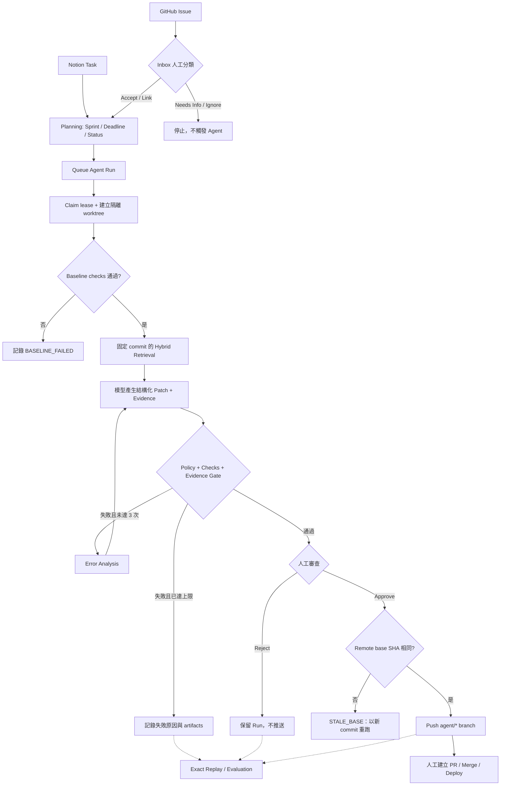

# Notion GitHub Coding Agent

一個 **human-in-the-loop AI coding workflow**：把 Notion 的內部任務與 GitHub 的外部 Issue 收進同一個工作台，讓 AI 在隔離的本機 worktree 分析程式碼、產生 patch 並執行檢查，最後由人決定是否推送分支。

> AI 可以準備修改，但不能自行上線。系統在人工核准前不會 push，也不會自動建立或合併 PR。

## 專案介紹影片

想先快速了解完整操作流程，可以觀看 [notion-github-coding-agent DEMO](https://youtu.be/TPr4YH-15n8)：

[](https://youtu.be/TPr4YH-15n8)

## 線上展示

- 網址：[https://notion-github-coding-agent.vercel.app](https://notion-github-coding-agent.vercel.app)
- 公開 Demo，免登入即可瀏覽

## 這個專案解決什麼問題

Notion 適合安排內部工作，GitHub 適合追蹤程式問題，但兩者都無法單獨回答以下問題：

1. 外部 Issue 的資訊是否足夠，能不能進入內部開發流程？
2. AI 修改前，如何證明原始專案本來可以正常建置與測試？
3. 模型看到哪些程式碼、改了哪些檔案、提出的證據是否真實？
4. 當 main branch 已經改變，如何避免推送建立在舊版本上的 Patch？
5. 換模型或 Prompt 後，如何在相同輸入條件下比較結果？

因此本專案在 Notion、GitHub 與 AI Agent 之間加入一層「工程決策與驗證流程」。AI 可以準備修改，但輸入範圍、修改權限、驗證條件與最終推送都由系統和人共同控制。

## 一筆任務如何走完整個工作流

| 階段 | 系統行為 | 失敗時 |
| --- | --- | --- |
| Intake | Notion Task 進入規劃；GitHub Issue 先經 Accept、Link、Needs Info 或 Ignore | 資訊不足時不觸發 Agent |
| Planning | 分開管理 Sprint／Deadline、工程狀態與 Agent 狀態 | 未完成任務不會自動搬到新 Sprint |
| Baseline | 在隔離 worktree 執行 install、lint、typecheck 與 test | Baseline 失敗即停止，不允許模型修改 |
| Retrieval | 依固定 commit 選取 keyword＋embedding Context，保存路徑與 hash | Embedding 失敗時降級為 keyword |
| Patch | 限制最多修改 3 個既有檔案，重跑 checks，最多重試 3 次 | 保留錯誤分析與 artifacts |
| Evidence Gate | 驗證模型引用的 path、line、quote 是否存在於 exact Context | 證據不一致即阻擋 Run |
| Human Gate | 人工審查 Diff、測試、風險與證據；Approve 時重查 remote base SHA | Base 已更新則拒絕推送並要求重跑 |
| Replay／Evaluation | 固定 Task、commit、Context 與 hash，比較模型、Prompt 與 Retrieval | 以 hidden checks 驗證 Patch、Regression 與 Safe Refusal |

通過人工核准後，系統只推送 `agent/*` 獨立分支；PR、Merge 與部署仍由人完成。完整欄位與狀態轉移見 [工作流程文件](docs/workflow.md)。

## 完整狀態流程



## 技術難點與設計取捨

| 難點                       | 直接做法的風險                                   | 本專案的處理方式                                                                 |
| -------------------------- | ------------------------------------------------ | -------------------------------------------------------------------------------- |
| Notion／GitHub 雙來源同步  | 重複事件、漏送事件、兩邊狀態互相覆寫             | Webhook event ID 去重、sync job retry、reconciliation 補償、欄位責任分離         |
| 多 Worker 與中斷恢復       | 同一 Run 被重複處理，或 crash 後永遠卡在 running | Active Run 唯一限制、claim owner、lease expiry 與 stale run recovery             |
| LLM Context 選擇           | 整個 repo 太大；不同 Run 看到不同內容而難以比較  | commit-bound index、Hybrid Retrieval、Context path/hash 持久化、keyword fallback |
| Patch 安全性               | 模型修改敏感檔案、執行任意指令或擴大變更範圍     | worktree 隔離、指令白名單、敏感路徑 policy、最多 3 個檔案                        |
| 「測試通過」仍可能理由錯誤 | 模型引用不存在的程式碼，審查者難以發現           | Evidence Gate 對 exact Context 驗證 path、line、quote                            |
| 核准與推送之間的競態       | main 已更新，舊 Patch 仍被推送                   | Approve 時重新 fetch 並比較 base SHA；不一致即拒絕推送                           |
| 模型／Prompt 評估          | 單次 Demo 的成功無法公平比較                     | Exact Replay 固定輸入；Benchmark 使用 hidden checks 與 refusal cases             |

## 技術架構

```text
Browser ───────→ Next.js Dashboard / API ───────→ Supabase Postgres
GitHub ─Webhook→ Next.js API                         ↑
Notion ─Webhook→ Next.js API                         │
Python Worker ───────────────────────────────────────┘
      │
      ├─ OpenAI Responses / Embeddings API
      ├─ isolated local Git worktree
      └─ GitHub agent/* branch（僅人工核准後）
```

| 元件                         | 責任                                                               |
| ---------------------------- | ------------------------------------------------------------------ |
| Next.js 15 / React 19        | Dashboard、Webhook 與操作 API                                      |
| Supabase Postgres / pgvector | 跨平台關聯、同步工作、Run、稽核與 repository embeddings            |
| Python 3.12 Worker           | Retrieval、worktree、patch、檢查、replay、evaluation 與核准後 push |
| OpenAI API                   | 正式 Task 的結構化分析、修改與 embeddings                          |
| Ollama（選用）               | 僅供 Evaluation 比較本地模型，不可產生正式 Task patch              |

## 專案結構

```text
notion-github-coding-agent/
├─ apps/web/                 Next.js Dashboard、API routes 與 Vercel Cron 設定
├─ workers/agent/            Python Worker、benchmark 與 retrieval evaluation
├─ supabase/migrations/      Database migrations（schema source of truth）
├─ supabase/seed.sql         單一 repository 的初始設定
├─ docs/                     架構、流程、安全、evaluation 與 Demo 文件
├─ .env.example              環境變數範本
└─ pnpm-workspace.yaml       pnpm workspace 設定
```

## 本機啟動

需求：Node.js 20+、pnpm、Python 3.12+、Git、Supabase project、Notion integration、GitHub fine-grained PAT 與 OpenAI API key。目前版本以單一管理者、單一 Notion workspace 與單一 repository 為目標。

### 1. 安裝依賴

```bash
git clone <repository-url>
cd notion-github-coding-agent
corepack enable
pnpm install

cd workers/agent
python3.12 -m venv .venv
source .venv/bin/activate
pip install -e '.[dev]'
cd ../..
```

### 2. 設定環境變數

```bash
cp .env.example apps/web/.env.local
```

依 [.env.example](.env.example) 填入 Supabase、GitHub、Notion、OpenAI 與內部 job secrets。Web 與 Worker 都讀取 `apps/web/.env.local`；不要提交此檔案或把 service role key、PAT 放進前端程式碼。

### 3. 建立資料庫

依序套用 `supabase/migrations/`，再修改並執行 `supabase/seed.sql`，設定 repository、default branch、本機路徑、檢查指令與 Notion Data Source。細節見 [資料庫設計](docs/database.md)。

### 4. 啟動 Web 與 Worker

Terminal 1：

```bash
pnpm dev
```

Terminal 2：

```bash
cd workers/agent
source .venv/bin/activate
python -m agent_worker.worker
```

開啟 [http://localhost:3000](http://localhost:3000)。若只想讓 Worker 處理目前一筆工作後結束，加入 `--once`。

## 事件通知與部署設定

Webhook endpoint：

```text
GitHub: https://<your-domain>/api/webhooks/github
Notion: https://<your-domain>/api/webhooks/notion
```

GitHub 至少訂閱 **Issues、Pull requests、Ping**。`apps/web/vercel.json` 每天台北時間 00:05 執行 Sprint 輪替與 reconciliation，用來補回漏送事件，但不取代 webhook。

本機若要立即處理待重試的 Notion 同步工作：

```bash
curl -X POST http://localhost:3000/api/internal/sync-jobs/process \
  -H "Authorization: Bearer $INTERNAL_JOB_SECRET"
```

## 評估

Web 的 **模型評估**頁可排程完整 dataset 或單一案例，並比較 prompt／模型結果；執行期間必須保持 Worker 運行。

```bash
cd workers/agent
source .venv/bin/activate

# 驗證 Benchmark Dataset，不呼叫模型
python -m agent_worker.eval_runner --validate-only

# 執行包含 12 個案例的 Agent Benchmark
agent-eval

# 比較 Keyword 與 Hybrid Retrieval
retrieval-eval
```

Benchmark 包含 5 個 patch、5 個 safety、2 個 quality 案例，使用 hidden acceptance checks 驗證修改。Dataset 規模只適合回歸與展示，不代表 production 統計結論。若使用 Ollama，模型名稱以 `ollama:` 開頭；本地模型只允許 Evaluation，沒有正式 Task 的推送能力。完整方法與限制見 [Evaluation 設計](docs/evaluation.md)。

## 驗證

Web：

```bash
pnpm lint
pnpm typecheck
pnpm test
pnpm build
```

Worker：

```bash
cd workers/agent
source .venv/bin/activate
ruff check .
pytest
```

## 安全邊界

- 僅操作資料庫白名單中的本機 repository；每次 Run 使用獨立 worktree。
- Baseline 失敗時不允許 AI 修改；模型不能自由執行 shell。
- 禁止修改 secrets、migration、CI/CD、部署、權限、付款與 lockfile 等敏感範圍。
- 禁止 force-push、直接修改 default branch、自動建立 PR 或自動 merge。
- Approve 前重新檢查 base SHA；main 更新後舊 diff 必須重跑。
- 外部 Issue 與 Notion 內容一律視為不受信任資料，不能覆寫 Worker policy。

更完整的 threat model 與 enforcement 見 [Agent 安全設計](docs/agent-safety.md)。

## 已知限制

- 目前是單一管理者、單一 repository 的本機導向 Demo，不是多人 SaaS。
- Worker 必須在可存取目標 repository 的機器上持續運行。
- PR 建立與合併仍由人工完成。
- 不持續雙向覆寫 Notion 與 GitHub 的 title／description。
- 現有 Retrieval Evaluation 中 Keyword 與 Hybrid 品質相同，而 Hybrid 延遲較高；目前沒有證據宣稱 embeddings 一定更好。
- 已測試的小型本地模型 smoke test 未通過，因此限制為 Evaluation-only。

## 文件

- [系統架構](docs/architecture.md)
- [完整工作流程](docs/workflow.md)
- [資料庫設計](docs/database.md)
- [Agent 安全設計](docs/agent-safety.md)
- [Evaluation 設計](docs/evaluation.md)
- [Demo 錄影腳本](docs/demo-script.md)
- [E2E Replay 紀錄](docs/e2e-agent-replay.md)
