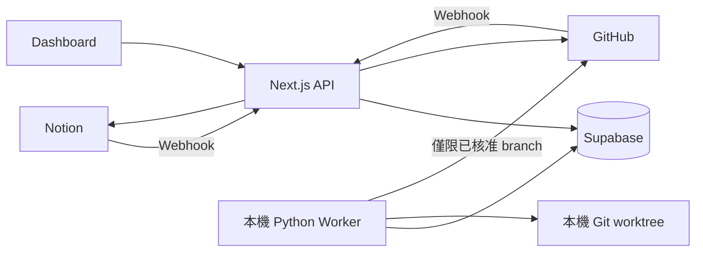
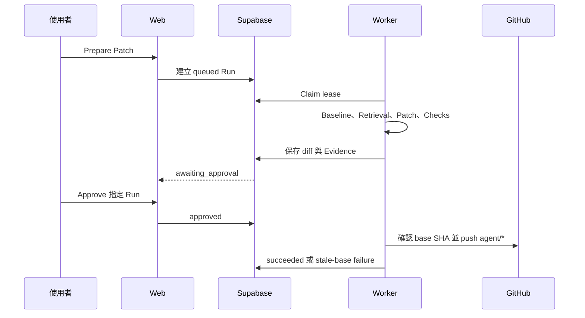

# 系統架構

本系統由 Notion、GitHub、Next.js Web、Supabase 與本機 Python Worker 組成。Supabase 是身分關聯與工作流程的主要資料庫，但內容權威仍依來源區分：Notion 管理內部需求，GitHub 管理工程狀態，Worker 管理 Agent 執行狀態。

## 元件責任

| 元件 | 負責 | 不負責 |
| --- | --- | --- |
| Notion | 內部需求、規劃狀態、Sprint、Deadline | 程式碼審查與 Agent 執行 |
| GitHub | 外部 Issue、repository、branch、PR 生命週期 | 內部優先順序 |
| Next.js Web | 登入、來源審核、Webhook、操作指令與結果呈現 | 直接修改 worktree 或判定 patch 安全 |
| Supabase | 跨系統身分、流程狀態、Run、步驟、artifact 與稽核紀錄 | 保存 repository checkout |
| Python Worker | Retrieval、patch、確定性檢查與核准後 push | 使用者登入、自動建立或合併 PR |
| OpenAI／Ollama | 在允許範圍內提供結構化推論 | 授權與安全政策執行 |

模型輸出一律視為未受信任的提案。路徑、Evidence、diff 與檢查通過前，都不能視為可核准結果。

## 整體資料流

## 驗證與信任邊界

- Dashboard 頁面與一般操作 API 需要已簽章的登入 Session。
- GitHub／Notion Webhook 使用各自的 Secret 驗證，且以 delivery ID 去重。
- `/api/internal/*` 使用 `INTERNAL_JOB_SECRET`，不依賴瀏覽器 Cookie。
- `/api/cron/reconcile` 使用 `CRON_SECRET`，供 Vercel Cron 呼叫。
- Supabase service role key 只存在 Server 與 Worker，不提供給瀏覽器。
- 只有本機 Worker 能存取 repository path 與建立 worktree。

Dashboard 採單一管理者密碼保護。未登入訪客只能透過 GitHub 原生介面提交 Issue，不能進入內部工作台。

## 資料權威與一致性

系統使用穩定的 provider ID 連結資料，不以 title 作為身分，也不持續雙向覆寫內容：

1. Webhook 先記錄唯一 delivery，再套用業務變更。
2. Provider 事件更新既有 work item，或建立可重試的 sync job。
3. Notion 寫入失敗會保留在 `sync_jobs`，可由介面重試。
4. 每日 reconciliation 查詢 GitHub，補回漏送的 Issue／PR 狀態。

這是一致性最終會收斂的設計。Dashboard 可能短暫落後 provider，但重送事件不應建立重複 Task、Issue、Run 或關聯。

## Agent 執行邊界

Web 只負責排程與人工決策，repository 變更全部由 Worker 執行。Run lease 可在 Worker 異常結束後回收工作，也降低兩個 Worker 同時處理同一 Run 的機率。

## 部署形態與限制

V1 預期使用 Vercel 上的 Next.js、Supabase Cloud，以及一台可存取目標 repository 的可信任本機 Worker。

- 僅支援單一管理者與單一 repository。
- 尚無多租戶隔離或匿名資料庫權限。
- Worker 必須在可信任且可長時間運行的機器上。
- Vercel Cron 只負責同步補償，不執行 Agent patch。

## 延伸文件

- [完整工作流程](workflow.md)
- [資料庫設計](database.md)
- [Agent 安全設計](agent-safety.md)
- [Evaluation 設計](evaluation.md)
