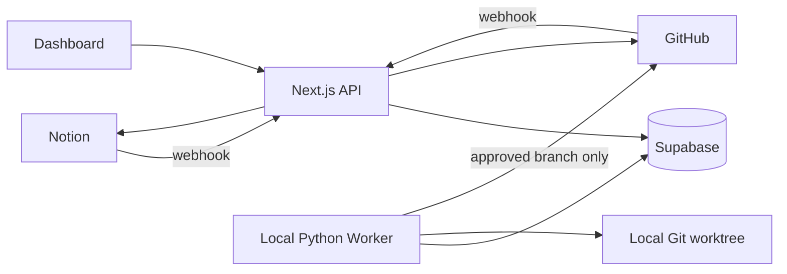

# Architecture

Dashboard 採單一管理者密碼保護。未登入訪客只能使用 GitHub 原生介面提出 Issue；Dashboard 頁面及一般操作 API 會被拒絕。GitHub／Notion Webhook 與 Vercel Cron 使用各自的簽章或 Bearer Secret，不經 Dashboard 登入。

`/api/internal/*` 同樣不依賴 Dashboard Cookie，但每個 endpoint 必須自行驗證 `INTERNAL_JOB_SECRET`。這可讓本機 Worker 或維運腳本呼叫，同時避免公開存取。

Supabase is the canonical identity and workflow store. Content authority remains source-based: Notion-origin requirements stay authoritative in Notion; GitHub-origin issue text stays authoritative in GitHub; GitHub owns engineering state; the worker owns agent state.
