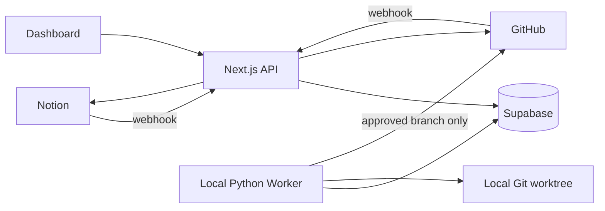

# Architecture

Supabase is the canonical identity and workflow store. Content authority remains source-based: Notion-origin requirements stay authoritative in Notion; GitHub-origin issue text stays authoritative in GitHub; GitHub owns engineering state; the worker owns agent state.

