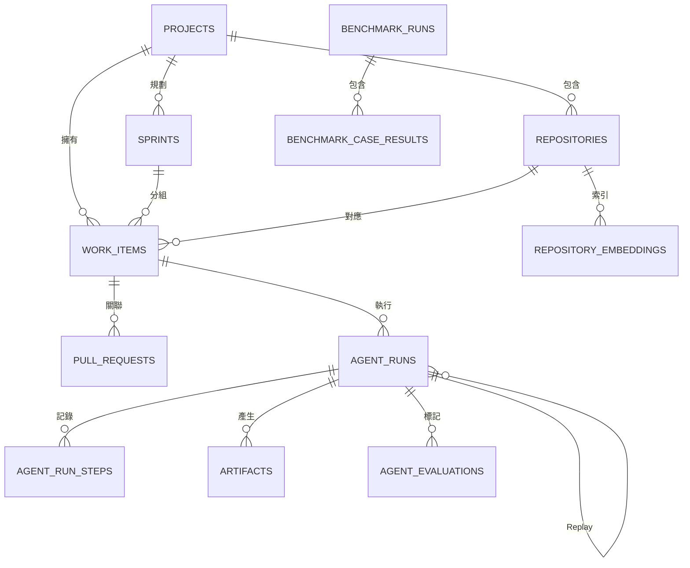

# 資料庫設計

`supabase/migrations/` 是 schema 的唯一權威來源。本文件說明設計意圖；若文件與 migration 不一致，應先以 migration 為準，再修正文件。

## 關聯概覽

## 主要資料表

| 資料表 | 用途 |
| --- | --- |
| `projects` | 專案與 Notion 設定 |
| `repositories` | GitHub 身分、default branch、本機路徑與允許的檢查指令 |
| `work_items` | 跨 provider 的工作身分與各種獨立狀態 |
| `sprints` | Notion Sprint 身分與日期區間 |
| `sprint_rotation_locks` | 防止排程重複執行造成 Sprint 重複建立 |
| `pull_requests` | PR number、node ID 與生命週期 |
| `sync_events` | Provider delivery 去重與稽核 |
| `sync_jobs` | 可重試的延後同步工作 |
| `agent_runs` | 單次 Agent 執行、決策、base SHA、diff、成本、lease 與 Replay metadata |
| `agent_run_steps` | Baseline、Retrieval、模型、Patch 與 Check 的有序紀錄 |
| `artifacts` | 需與步驟紀錄分開保存的 Run 產物 |
| `worker_heartbeats` | Worker 最後上線時間與 metadata |
| `repository_embeddings` | 依 commit 保存 path、content hash 與 vector，不保存原始碼 |
| `agent_evaluations` | 人工對真實 Run 的評分 |
| `benchmark_runs` | Dataset、模型、Prompt 層級的評估摘要 |
| `benchmark_case_results` | 各案例的 grader、指標、Context 與失敗原因 |

## 狀態分離

`work_items` 不使用一個包辦所有語意的 status：

| 狀態 | 回答的問題 | 範例 |
| --- | --- | --- |
| `review_state` | 外部 Issue 是否已被內部接受？ | `pending`、`accepted`、`linked`、`needs_info`、`ignored` |
| `planning_state` | Task 位於哪個規劃階段？ | `draft`、`ready`、`in_progress`、`blocked`、`done` |
| `agent_state` | Coding Agent 目前在做什麼？ | `idle`、`queued`、`awaiting_approval`、`branch_ready`、`failed` |
| `pr_state` | 工程修改的 PR 結果為何？ | `open`、`closed`、`merged` |

這可避免「忽略的 Issue 看起來像已完成」或「Agent 失敗覆寫產品規劃狀態」等錯誤。

## 身分與冪等性

系統使用穩定的外部 ID，不使用 title。Notion page ID、GitHub Issue node ID 與 Webhook delivery ID 都有唯一限制。部分唯一索引限制每個 work item 同時只能有一個 active Run，終止的歷史 Run 則保留供稽核與 Replay。

Webhook 重送時會先找到既有 `sync_events`，避免重複套用效果。Reconciliation 使用相同的外部身分，因此只補回缺少的狀態。

## 執行紀錄、產物與重播

`agent_runs` 保存 status、base commit、branch、diff、結構化分析、risk、token／cost、錯誤碼、claim owner 與 lease expiry。`agent_run_steps` 保存每一步與 attempt number，讓最終失敗可以被追查。

Exact Replay 額外保存：

- `parent_run_id`：父子 lineage；
- `replay_mode`：`exact` 或 `latest`；
- `task_snapshot`：固定的需求輸入；
- `context_manifest`：選取路徑與 content hash。

Raw source 不存入 vector table，而是從已驗證的 Git commit 重新讀取。

## 資料庫遷移流程

Migration 必須按檔名順序套用。已套用的 migration 不應直接修改；任何 schema 變更都應新增 timestamp migration。`supabase/seed.sql` 是單一 Demo 專案的設定，執行前要確認 repository path、default branch 與各檢查指令。

建議驗證：

1. 確認所有 migration 已出現在目標環境。
2. 執行 seed，檢查 project／repository 身分。
3. 開啟 `/settings` 檢查 provider 連線。
4. 重送同一 Webhook，確認只產生一個邏輯結果。
5. 對同一 Task 排程兩次，確認 active-run 限制生效。

## 權限與恢復

V1 沒有匿名 RLS policy，資料庫操作只允許 Server 或 Worker 使用 service role。若把 Supabase table 直接暴露給瀏覽器，會繞過應用程式授權，與目前架構不相容。

故障恢復應保留歷史：重試 `sync_jobs`、等待過期 lease 被重新 claim，或在 `STALE_BASE` 後建立替代 Run。不要為了清理介面刪除失敗 Run，因為步驟與 artifact 就是稽核紀錄。
