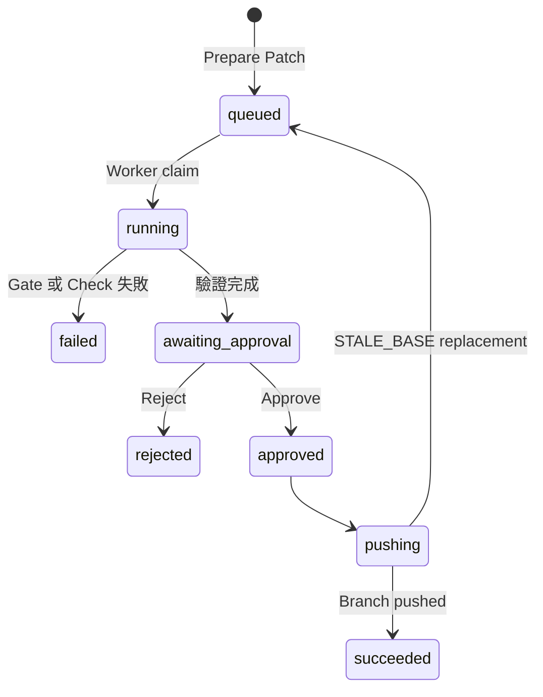

# 完整工作流程

GitHub Webhook 是即時同步入口。Vercel Cron 每天 04:00 UTC（台北時間 12:00）執行 reconciliation，補回漏送的 Issue／PR 狀態，並處理最多 10 筆待回寫 Notion 的工作。Cron 是安全網，不取代 Webhook。

## Notion 來源

1. Notion Webhook 匯入 Task，但不自動建立 GitHub Issue。
2. 使用者在 Task Detail 明確選擇建立 Issue。
3. 系統保存 GitHub Issue 身分並連結原 Task。
4. Notion 頁面刪除時只標記來源已刪除，不刪除稽核歷史。

Sprint、Deadline 與 Agent Run 彼此獨立；規劃狀態改變不會自動觸發程式碼修改。

## GitHub 來源

外部 Issue 必須先進 Inbox：

| 決定 | 結果 |
| --- | --- |
| Accept | 建立 Notion sync job，轉為正式內部工作 |
| Link | 連結使用者選取的既有 Notion Task |
| Needs Info | 保持等待，不進入正式工作 |
| Ignore | 封存；後續更新不會自動重新出現 |

Issue 文字是不受信任的輸入，不能覆寫 Worker policy。

## Agent 修改狀態

執行順序：

1. Snapshot Task 與 repository 設定。
2. 解析 remote default branch commit，建立隔離 worktree。
3. 執行 install、lint、typecheck、test baseline。
4. 以 Hybrid Retrieval 選取 Context；Embedding 失敗時降級為 Keyword。
5. 模型回傳結構化決定、計畫、risk、Evidence 與最多 3 個檔案替換。
6. 驗證路徑與實際 changed files。
7. 執行 Checks 與 Evidence Gate；最多嘗試 3 次。
8. 保存 diff 等待核准，或保存終止失敗。

Approve 只適用於指定 Run。Push 前若 remote SHA 已改變，系統產生 `STALE_BASE` 並從最新 commit 建立替代 Run，不會偷偷 rebase 已審核的 diff。

## PR 與同步完成

Worker push `agent/*` 後，由使用者手動建立與合併 PR。PR Webhook 更新 Dashboard；只有 merged 才代表工程工作完成，closed 不等於 done。

同步失敗會保存在 `sync_jobs`，可從 `/sync` 重試，或以 `INTERNAL_JOB_SECRET` 呼叫內部處理 API。所有重試都必須依穩定外部 ID 保持冪等。

## 常見錯誤

| 錯誤碼 | 意義 | 處理方式 |
| --- | --- | --- |
| `BASELINE_FAILED` | 修改前 repository 已失敗 | 修正環境或設定後建立新 Run |
| `PATCH_NOT_SAFE` | 模型或 policy 拒絕工作 | 縮小或澄清範圍 |
| `PATCH_EVIDENCE_MISSING` | 引用與 Context 不符 | 檢查 Prompt／結果，不可繞過 |
| `PATCH_SCOPE_VIOLATION` | 修改超過政策範圍 | 拆小 Task 或人工處理 |
| `NO_CHANGES` | 沒有有效 diff | 補充需求後重跑 |
| `STALE_BASE` | 核准後 main 已改變 | 審核新建立的替代 Run |

延伸閱讀：[架構](architecture.md)、[資料庫](database.md)、[Agent 安全](agent-safety.md)。
